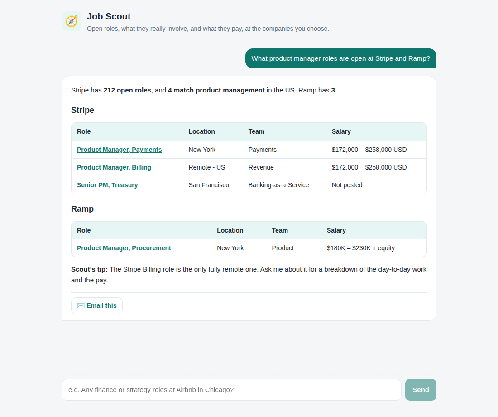

# Job Scout

A chat app that finds open jobs at the companies you choose, explains each role in plain language, and gives a salary range. You can email any answer to yourself.

Built with Next.js and TypeScript, hosted on Vercel, powered by Claude.



## How it works

```
 You: "PM roles at Stripe and Ramp?"
        │
        ▼
 ┌──────────────┐  streams answer   ┌──────────────────────────────────────────┐
 │ Chat UI      │ ◀──────────────── │ /api/chat: Claude (claude-opus-5-5)        │
 │ (markdown,   │                   │                                          │
 │  tables)     │                   │  find_company_jobs ─▶ Greenhouse / Lever / │
 └──────┬───────┘                   │                       Ashby public boards  │
        │ "Email this"              │  get_job_details   ─▶ full posting + pay   │
        ▼                           │  web_search        ─▶ salary market data,  │
 ┌──────────────┐                   │                       careers pages        │
 │ /api/email   │ ─▶ Resend         │  web_fetch         ─▶ custom careers pages │
 └──────────────┘                   └──────────────────────────────────────────┘
```

- **Job data comes from the employers' own job boards.** Most companies post through Greenhouse, Lever or Ashby, which publish free public feeds. Scout reads those feeds directly with ordinary code (`lib/jobs/boards.ts`), so the listings and links are real and up to date.
- **Claude handles the judgment calls:** working out which board a company uses, explaining what a job involves, and building the salary picture.
- **Salary is always labeled.** Scout uses **Posted by employer** when the posting includes a pay range, and **Estimate** (with sources) when it searched market data instead.

## Project layout

| Path | What it does |
|---|---|
| `components/Chat.tsx` | Chat interface: streaming answers, formatted tables, "Email this" button |
| `app/api/chat/route.ts` | Streams Scout's answer to the browser |
| `lib/scout/agent.ts` | Claude conversation loop that runs tools as Claude requests them |
| `lib/scout/prompt.ts` | Scout's personality and answer formats. Edit this to change the tone or layout. |
| `lib/scout/tools.ts` | Job-board tools that Claude can call |
| `lib/jobs/boards.ts` | Greenhouse, Lever and Ashby adapters |
| `lib/email.ts`, `app/api/email/route.ts` | Formats answers as HTML email and sends them through Resend |

## Run locally

```bash
npm install
cp .env.example .env.local   # then fill in the values
npm run dev                  # http://localhost:3000
```

| Variable | Purpose |
|---|---|
| `ANTHROPIC_API_KEY` | Claude API key from console.anthropic.com |
| `RESEND_API_KEY` | API key from resend.com, used to send email |
| `EMAIL_FROM` | Sender, e.g. `Job Scout <scout@yourdomain.com>`. The domain must be verified in Resend. |
| `EMAIL_ALLOWLIST` | Addresses (`me@uco.edu`) and/or domains (`@uco.edu`) that answers may be emailed to. If it's empty, all email is blocked. |

## Deploy to Vercel

1. Import this repository at vercel.com/new. Vercel detects Next.js automatically.
2. Add the four environment variables above under **Settings → Environment Variables**.
3. Deploy. The chat route can run for up to 300 seconds, so answers that cover several companies don't time out.
4. Recommended: turn on **Deployment Protection** so only people you invite can use the app (and spend API credit).

## Checks

```bash
npm run typecheck
npm test
npm run build
```

## Next steps

- Workday adapter (used by many large employers)
- Saved company watchlists, plus a daily "new jobs" email using a Vercel Cron job
- Sign-in, so each user keeps their own history and preferences
