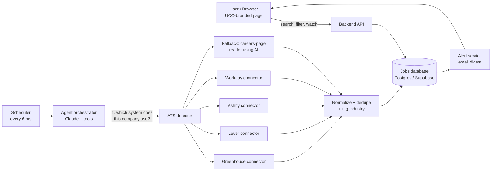

# Job Scout Agent — Architecture Plan

## 1. The one-paragraph version

The user picks the companies they care about. On a schedule, the agent visits
each company's job listings, pulls every open role, cleans the listings up so
they all look the same, tags each one with an industry, and saves them. The web
page (in UCO blue and gold) lets the user browse by **industry dropdown** or type
into a **search bar**. New matches can be emailed to the user.

## 2. Think of it like a scouting department

| Real-world role | System component | What it does |
|---|---|---|
| **The GM's wish list** | *Watchlist* (database table) | The companies the user picked |
| **Scouts in the field** | *Connectors* | Each scout knows one kind of territory (Greenhouse, Lever, Workday, or a plain careers page) |
| **Head scout** | *Agent orchestrator* (Claude) | Decides which scout to send, reads messy reports, sorts and labels them |
| **Filing cabinet** | *Jobs database* | One standard folder per job, no duplicates |
| **War-room board** | *Web page* | Industry dropdown + search bar to find jobs fast |
| **Morning briefing** | *Alerts* | Email: "3 new roles at companies you watch" |

The key decision: **send the cheap, reliable scouts first, and use the expensive
expert (the AI) only when a scout can't read the territory.** Most large
employers publish jobs through a few hiring systems that have free, structured
feeds. The AI only steps in for one-off careers pages and for labeling.

## 3. System diagram



## 4. Components

### 4.1 Front end (the page)
- **Colors:** UCO Blue `#002B7F` (primary, headers, buttons) and UCO Gold `#FFD100`
  (accents, highlights, active states) on white. Text on blue is white; text on
  gold is blue, never white (contrast).
- **Search bar:** free text across title, company, location and description.
  Results filter as the user types.
- **Industry dropdown:** Technology, Finance & Banking, Healthcare, Human Resources, Energy,
  Education, Government & Public Sector, Manufacturing, Retail & Consumer,
  Consulting, Nonprofit, Aerospace & Defense, Media & Entertainment.
- Secondary filters: location / remote, posted-within, "only my watched companies".
- **Watchlist panel:** add or remove companies.
- **Smart search:** each word matches on its own, in any order, with related terms (e.g. "HR" also
  finds recruiter, talent, benefits and people-operations roles). Title matches rank first; jobs
  matching only some words appear below as close matches.
- **Location filter:** Oklahoma + Remote (default), Oklahoma only, Remote only.
- **Job details:** clicking a job opens a panel with location, work style, industry, type,
  level, salary (when posted), full description, "Apply on employer site" and "Watch company".
- Working prototype: [`web/index.html`](../web/index.html), backed by the
  [`/api/jobs`](../api/jobs.js) Vercel function (falls back to sample data when opened locally).
- Production: Next.js or plain React, hosted on Vercel.

### 4.2 Backend API
| Endpoint | Purpose |
|---|---|
| `GET /jobs?q=&industry=&location=&remote=&since=` | Search + filter |
| `GET /industries` | Fills the dropdown |
| `GET/POST/DELETE /watchlist` | Manage chosen companies |
| `POST /scan/{company}` | "Check now" button |
| `GET/PUT /alerts` | Email preferences |

Python (FastAPI) or Node; either works. Supabase can provide database, login and
scheduled functions in one package, which keeps the early team small.

### 4.3 Agent orchestrator (where Claude fits)
Claude is used for **judgment**, not for routine fetching:
1. **Find the source:** given "Devon Energy", locate the careers page and identify
   which hiring system it runs on.
2. **Read unstructured pages:** when no feed exists, pull title, location, and link
   out of the HTML.
3. **Label:** assign an industry and role family (e.g., "Finance → Analyst").
4. **Match (later):** rank jobs against the user's résumé or preferences.

Implemented as Claude with tools (`fetch_url`, `detect_ats`, `call_connector`,
`save_jobs`).

**API key:** the agent authenticates with the Claude API key named **"UCO MBA"**,
supplied through the `UCOMBA` environment variable (`UCOMBA_API_KEY`, `UCO_MBA_API_KEY`
and `UCO_MBA` are also accepted) (see
[`agent/config.py`](../agent/config.py) and [`.env.example`](../.env.example)).
Locally it lives in a git-ignored `.env` file. In production it lives in the
hosting provider's secret settings. It is never stored in the code. Model choice: a small, fast model for labeling at volume; a larger
model only for the hard careers-page cases.

### 4.4 Connectors (the scouts)
| Source | How | Reliability |
|---|---|---|
| Greenhouse | Public JSON: `boards-api.greenhouse.io/v1/boards/{co}/jobs` | High |
| Lever | Public JSON: `api.lever.co/v0/postings/{co}` | High |
| Ashby | Public posting API | High |
| Workday | Company-specific JSON behind the careers site | Medium |
| **The Muse** (live now) | Public jobs API, filtered to 15 Oklahoma cities + "Flexible / Remote" | High |
| **Remotive** (live now) | Public remote-jobs API, kept only when US-eligible; must credit and link back | High |
| **USAJOBS** (ready; needs key) | Official federal jobs API: everything located in Oklahoma plus remote HR (series 0201). Includes salary ranges. Turns on when `USAJOBS_API_KEY` and `USAJOBS_EMAIL` are set | High |
| Indeed / ZipRecruiter | Partner APIs (connectors are already available in this workspace) | Medium. Check terms of use |
| Any other careers page | Fetch HTML → Claude extracts | Lower; most expensive |

Each connector returns the same **standard job record**, so adding a new source never
touches the rest of the system.

### 4.5 Data model
```
companies(id, name, industry, careers_url, ats_type, ats_slug, last_scanned_at)
watchlist(user_id, company_id, created_at)
jobs(id, company_id, external_id, title, location, remote, industry,
     department, url, description, posted_at, first_seen_at, last_seen_at, status)
users(id, email, alert_frequency, preferred_industries[])
```
- `(company_id, external_id)` is unique, so the same job is never stored twice.
- A job missing from two scans in a row is marked `closed`.
- `first_seen_at` drives "new since last time" alerts.

### 4.6 Scheduler and alerts
- Scan watched companies every 6 hours (cron / Supabase scheduled function).
- After each run, collect jobs with `first_seen_at` since the last digest and email them.

## 5. Phased rollout

| Phase | Scope | Outcome |
|---|---|---|
| **MVP (2–3 wks)** | Greenhouse + Lever connectors, watchlist, search + industry dropdown, UCO theme | Usable demo for ~70% of tech/startup employers |
| **V1 (4–6 wks)** | Workday + AI fallback reader, email digests, login | Covers most large enterprises (incl. Oklahoma employers) |
| **V2** | Résumé matching, "why this fits you" summaries, career-center dashboard | Value for UCO Career Development and students |

## 6. Decisions leadership must make

1. **Build vs. buy:** aggregator APIs are fast to start but cost per call and limit
   control. Direct connectors are free and reliable, but engineering owns them.
   *Recommendation: direct connectors first, aggregators to fill gaps.*
2. **Legal and terms of use:** only use public feeds and official APIs, respect
   `robots.txt`, rate-limit, and link back to the employer's posting rather than
   republishing full descriptions.
3. **AI cost guardrail:** AI only on fallback and labeling; cache labels per job.
   Expect pennies per company per day at MVP scale.
4. **Data privacy:** if résumés are added in V2, they need consent, encryption,
   and a deletion policy (FERPA considerations if tied to student records).
5. **Brand use:** the UCO logo is trademarked. Get University Communications approval
   before any public launch.

## 7. Risks
| Risk | Mitigation |
|---|---|
| Careers sites change layout | Prefer structured feeds; AI fallback adapts; alert on zero-result scans |
| Being blocked for scraping | Official APIs, polite rate limits, identifying user-agent |
| Wrong industry labels | Company-level default industry + user correction button |
| Stale jobs | `last_seen_at` + auto-close logic |

## 8. "Ask the Scout" agent (live)

The `/api/agent` endpoint runs Claude (`claude-opus-5-5`, key from `UCOMBA`) with two tools:

| Tool | When Claude calls it | What it does |
|---|---|---|
| `update_employer_list` | The user names companies to watch or drop | Saves them and finds each company's job board from the name alone with **Tavily**, preferring the employer's own board (Greenhouse, Lever, Ashby, Workday, iCIMS, a careers page) over aggregators like Indeed or LinkedIn |
| `find_open_roles` | The user asks about a type of job | Searches each saved company's board and returns title, location, pay and a link per posting, grouped by company |

How `find_open_roles` reads a board:
- **Greenhouse / Lever / Ashby:** reads the public job feed directly. Fast, free, includes pay when posted.
- **Any other careers site:** **Tavily** searches that company's domain for the role; **Firecrawl** opens each posting and returns clean text; Claude extracts title, location and pay in one structured call per company (pages that aren't a single open posting are dropped).

The page shows the result as a comparison table grouped by company with clickable links. The saved companies and their job boards are kept in the visitor's browser and sent with each request, so the server stays stateless.

Keys (Vercel → jbsct → Environment Variables): `UCOMBA` (required), `TAVILY_API_KEY` (required to find boards), `FIRECRAWL_API_KEY` (needed to read postings on non-ATS careers sites; without it those postings are listed as links only).

Cost guardrails: messages are capped at 1,000 characters, 15 companies, 5 agent turns, 6 postings read per company and 15 rows per company; refusals fall back server-side (`fallbacks: "default"`).
